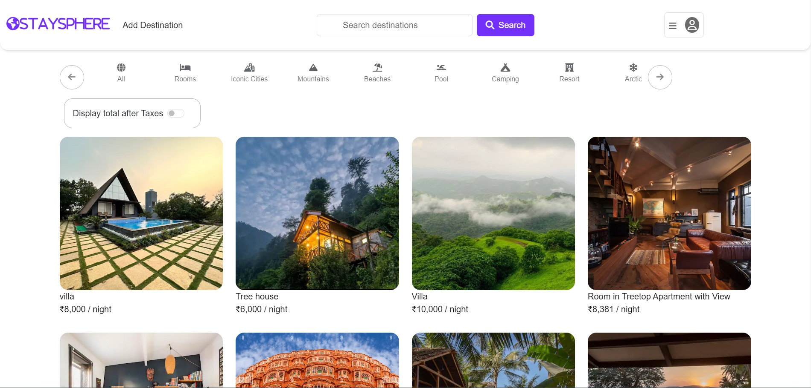
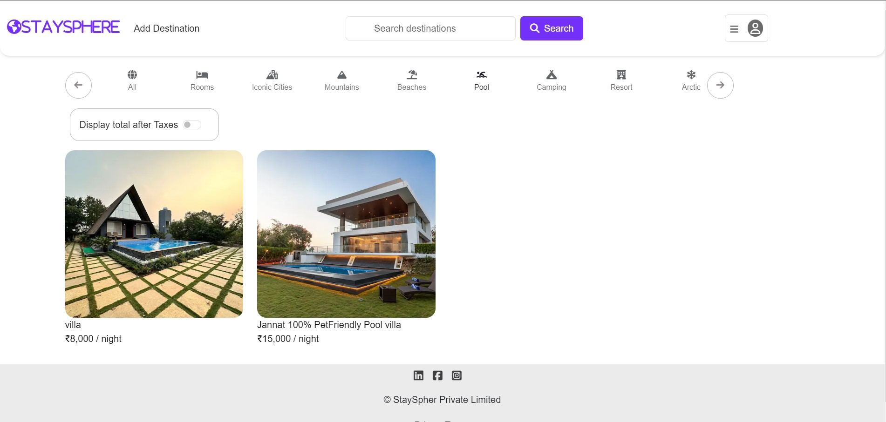
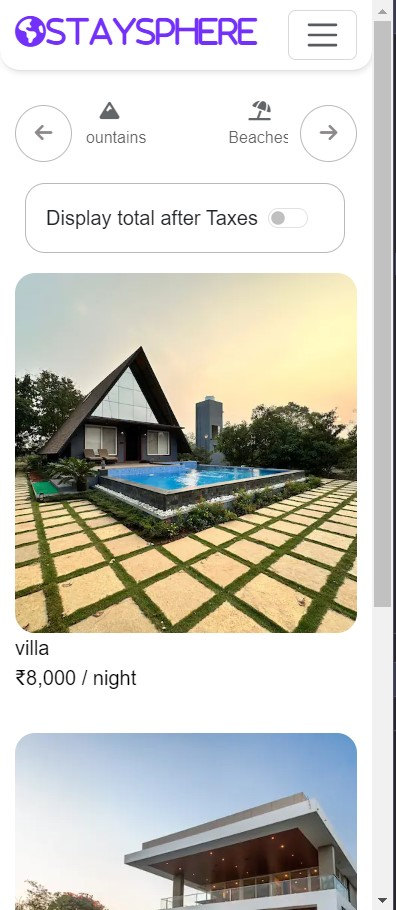
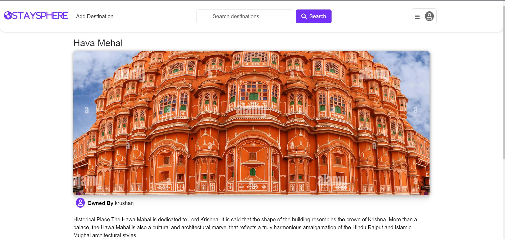

# StaySphereFullStackProject
# StaySphere

StaySphere is a full-featured travel listing and review application, similar to Airbnb. Users can create, read, update, and delete listings, as well as add reviews to these listings. 

## Table of Contents

- [Features](#features)
- [Images](#images)
- [Installation](#installation)
- [Usage](#usage)
- [Folder Structure](#folder-structure)
- [Contributing](#contributing)
- [License](#license)
- [Feedback](#feedback)

## Features

- User authentication with Passport.js
- Create, read, update, and delete listings
- Upload images for listings using Cloudinary
- Review system with ratings and comments
- Flash messages for success and error notifications
- Data validation with Joi
- MongoDB session storage with connect-mongo
- Responsive UI with Bootstrap

## Images









## Installation

1. **Clone the repository:**

    ```sh
    git clone https://github.com/Patil-Sanika/FullStackProject
    cd StaySphere
    ```

2. **Install dependencies:**

    ```sh
    npm install
    ```

3. **Set up environment variables:**

    Create a `.env` file in the root directory and add the following:

    ```env
    NODE_ENV=development
    PORT=8080
    SECRET=yourSecretKey
    ATLASDB_URL=yourMongoDBAtlasURL
    CLOUD_NAME=yourCloudinaryCloudName
    CLOUD_API_KEY=yourCloudinaryAPIKey
    CLOUD_API_SECRET=yourCloudinaryAPISecret
    ```

4. **Run the application:**

    ```sh
    npm start
    ```

## Usage

1. **Navigate to the application:**

    Open your browser and go to `http://localhost:8080`.

2. **Create an account:**

    Sign up for a new account or log in with an existing one.

3. **Create a new listing:**

    Click on the "New Listing" button, fill out the form, and submit.

4. **Review a listing:**

    Navigate to a listing and add a review with a rating and comment.

## Folder Structure
```plaintext
StaySphere/ 
├── controller/ # Route controllers 
│   ├── listings.js 
│   ├── review.js 
│   └── users.js 
├── models/ # Mongoose models 
│   ├── listing.js 
│   ├── review.js 
│   └── users.js 
├── public/ # Static files 
│   ├── css/ 
|   |   ├── rating.css
|   |   └──style.css
│   └── js/ 
        └──script.js
├── routes/ # Express route handlers 
│   ├── listing.js 
│   ├── review.js 
│   └── user.js 
├── utils/ # Utility functions 
│   ├── ExpressError.js 
│   └── wrapAsync.js 
├── views/ # EJS templates 
|   ├── includes/
|   |    ├── flash.ejs 
|   |    ├── footer.ejs
|   |    └── navbar.ejs
│   ├── listings/ 
│   |    ├── edit.ejs 
│   |    ├── error.ejs
│   |    ├── index.ejs 
│   |    ├── new.ejs
│   |    └── show.ejs
│   ├── layouts/ 
│   |    └── boilerplate.ejs 
│   └── users/ 
│       ├── login.ejs
│       └── signup.ejs
│ 
├── .env # Environment variables 
├── app.js # Main application file 
├── cloudConfig.js # Cloudinary configuration
├── middleware.js 
├── package.json # Project metadata and          dependencies 
├── README.md # Project documentation
└── schema.js
```
## Contributing

Contributions are welcome! Please fork the repository and submit a pull request with your changes. For major changes, please open an issue first to discuss what you would like to change.
 
## License

This project is licensed under the MIT License.

## Feedback
If you have any feedback, please reach out to us at patilsanika0711@gmail.com
